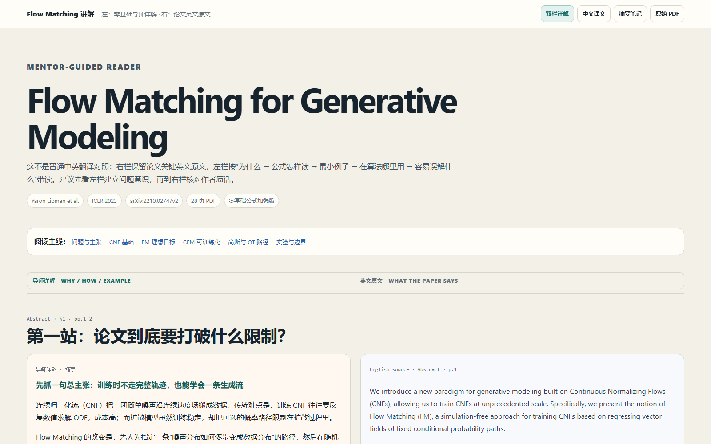
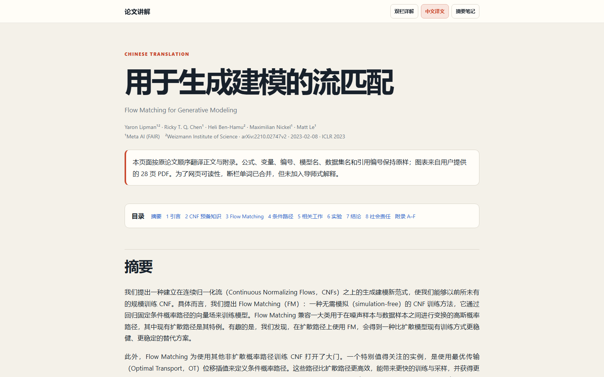

# Paper Reader

> Turn one research paper into a beginner-friendly learning experience: a mentor-led tutorial, an aligned explanation–source reader, a faithful Chinese translation, and durable reading notes.

<p align="center">
  <a href="README_zh.md">中文说明</a> · <a href="#see-a-real-output">See an example</a> · <a href="#get-started">Get started</a> · <a href="SKILL.md">Skill specification</a>
</p>

<p align="center">
  <a href="https://github.com/Starry-Curry/Paper-reader/stargazers"></a>
  <a href="LICENSE"></a>
  <a href="SKILL.md"></a>
</p>

Reading a paper is not the same as translating it. **Paper Reader** is a focused `paper-to-course` Skill for readers who want to understand a paper's argument, work through its equations, and keep a concise record they can revisit later. It is especially designed for people entering a field for the first time.

## Why this is different

- **One learning spine, not a copied table of contents.** The tutorial follows “why it matters → minimal intuition → formal definition → how to calculate the formula → how the algorithm runs → what the experiment proves”.
- **Equations are taught, not merely displayed.** Important equations are classified as anchor, bridge, or bookkeeping equations. Every anchor equation must explain the problem it solves, prerequisites, symbols, a hand-computable toy example, a derivation ladder, its place in the algorithm, and common misconceptions.
- **A real guided reader, not a bilingual dump.** Its characteristic `guided-reader.html` aligns beginner-friendly mentor explanation on the left with the corresponding English paper source on the right. Each pair keeps a source anchor such as section, page, figure, table, or equation number.
- **Four independent artifacts.** You can learn from the tutorial, cross-check the source, read a continuous Chinese translation, or return months later to a compact Markdown note.
- **Quality gates are part of the Skill.** The build checks the translation, notes, and guided reader. Missing paired columns, missing English source, unresolved placeholders, broken local links, or non-responsive guided-reader CSS fail validation.

## See a real output

The screenshots below come from the generated reading package for *Flow Matching for Generative Modeling*—not from a mockup.

### 1. Start with the paper's real problem and one learning spine


### 2. Read explanation and original English side by side



### 3. Keep a faithful, continuous Chinese reading version



The same example also includes a formula dependency map and step-by-step walkthroughs for FM, CFM/Theorem 2, Gaussian paths, OT-CFM, and ODE sampling. See the output contract in [SKILL.md](SKILL.md).

## What you get for every paper

| Artifact | What it is for |
| --- | --- |
| `index.html` | A visual mentor-style tutorial that explains the research question, mechanism, formulas, training, inference, evidence, and limitations. |
| `guided-reader.html` | The signature two-column reader: detailed Chinese mentor guidance on the left; aligned English source passages on the right. |
| `translated-paper.html` | A faithful Chinese reading edition that preserves the original section order, equations, captions, tables, citations, and appendices. |
| `paper-notes.md` | A compact, stand-alone reading note with the problem, contribution, essential implementation, main evidence, limitations, and optional takeaways. |
| `assets/figures/` | Locally referenced source figures, crops, and clearly labelled teaching diagrams shared by the artifacts. |

## Formula tutoring standard

For a method paper, Paper Reader first draws the equation dependency chain. It then gives every **anchor equation** the following treatment:

```text
What problem does it solve?
→ What do I need to know first?
→ How do I read the original equation aloud?
→ What does every symbol, input, and output mean?
→ Can I calculate one tiny numerical example?
→ How does the derivation proceed without a hand-wave?
→ Where does this equation appear during training or inference?
→ What is the most likely beginner misconception?
```

This makes the page useful even when “take the expectation”, “condition on x”, or “solve the ODE” are not yet familiar phrases.

## Get started

### 1. Install the Skill

Clone this repository or install it from its GitHub URL with your Skill manager. For Codex, place the repository root in your skills directory (or use Codex's GitHub skill installer); for Claude-compatible setups, the included `.claude-plugin/` metadata is also available.

```bash
git clone https://github.com/Starry-Curry/Paper-reader.git paper-to-course
```

### 2. Give it a paper

Provide a local PDF, arXiv/DOI/web link, LaTeX source, or verifiable paper text. Then ask, for example:

```text
Use $paper-to-course to read this paper for a beginner.
Explain the key formulas step by step and generate the complete reading package.
```

### 3. Validate a generated package

The default pipeline assembles the tutorial and verifies all four default outputs:

```bash
node scripts/build-all.js ./my-paper-course
```

You can also validate a single artifact:

```bash
node scripts/build-all.js ./my-paper-course --html
node scripts/build-all.js ./my-paper-course --guided
node scripts/build-all.js ./my-paper-course --translation
node scripts/build-all.js ./my-paper-course --notes
```

The core validation scripts are dependency-free. Legacy slide generation remains opt-in only through `--pptx`; this project deliberately concentrates on paper reading first.

## Designed for trustworthy paper reading

Paper Reader requires the full paper to be read before making a complete tutorial. It preserves source locators for key claims, clearly distinguishes paper facts from mentor interpretation and further inference, and keeps original equations separate from teaching rewrites. The translation is not allowed to silently become an abstract.

It is intentionally **not** a peer-review bot, a reproduction planner, a literature survey system, or a generic slide generator. Keeping the scope narrow is what lets the four reading artifacts reinforce one another.

## Repository layout

```text
.
├── SKILL.md                         # Workflow and non-negotiable completion criteria
├── agents/openai.yaml               # Codex-facing metadata
├── assets/
│   ├── guided-reader-template/      # Two-column reader shell and responsive CSS
│   └── translation-template/        # Continuous Chinese paper reader shell and CSS
├── docs/screenshots/                # Real generated-output screenshots used above
├── references/
│   ├── formula-tutorial.md          # Anchor-equation teaching protocol
│   ├── guided-reader.md             # Left-explanation/right-source contract
│   └── ...
└── scripts/
    ├── build-all.js                 # Four-artifact build and validation pipeline
    ├── validate-guided-reader.js    # Alignment/source/responsiveness checks
    ├── validate-translation.js
    └── validate-notes.js
```

## Contributing and support

Issues and pull requests are welcome—especially example papers, clearer formula explanations, output-quality checks, and accessibility improvements. If this makes one difficult paper easier to read, please [star the repository](https://github.com/Starry-Curry/Paper-reader/stargazers). Stars help us prioritize the next improvements.

## License

[MIT](LICENSE)
